This project, Practical Application 1, is for a data science assignment based on the data from the UCI Machine Learning repository and was collected via a survey on Amazon Mechanical Turk. The survey describes different driving scenarios including the destination, current time, weather, passenger, etc., and then ask the person whether he will accept the coupon if he is the driver. Answers that the user will drive there ‘right away’ or ‘later before the coupon expires’ are labeled as ‘Y = 1’ and answers ‘no, I do not want the coupon’ are labeled as ‘Y = 0’. There are five different types of coupons -- less expensive restaurants (under $20), coffee houses, carry out & take away, bar, and more expensive restaurants ($20 - $50). 

The project notebook can be found [here](./prompt.ipynb)

Below are a few observations from the data analysis : 

1. Drivers choose to mostly accept coupons for 'Coffee House', 'Restaurant less than 20 mins away' or 'Carry out & Take Away'.
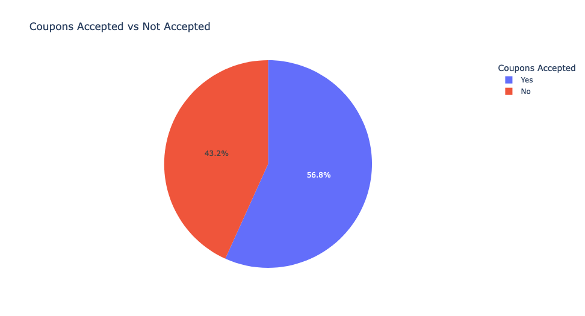 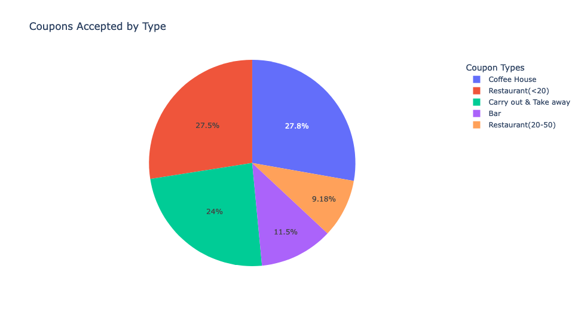

2. Majority prefer to accept Bar/Cofee House coupons when the temperatures are higher than 50

3. Drivers prefer to accept Restaurants coupons when the temperature is around 80 and the restaurants are less than 20 mins away. And, Drivers prefer to stay home and accept Carry out & Take away when the temperatures are around 30, colder temperatures not willing to drive.
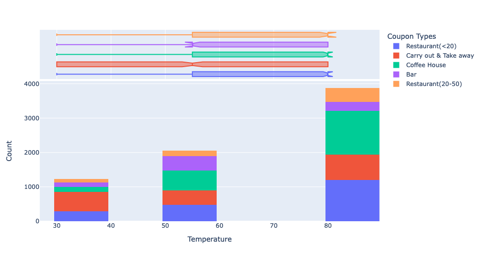

4. We see that Drivers/Customers based on different marital status accept coupons for different businesses.
    4.1 Single drivers and Drivers with Married/Unmarried Partners compose the majority of the customers who accept coupons.
    4.2 Single drivers prefer to accept coupons for Restaurants 20 mins away, carry out & Take away and coffee houses more compared to other businesses. Please refer to the below diagram.
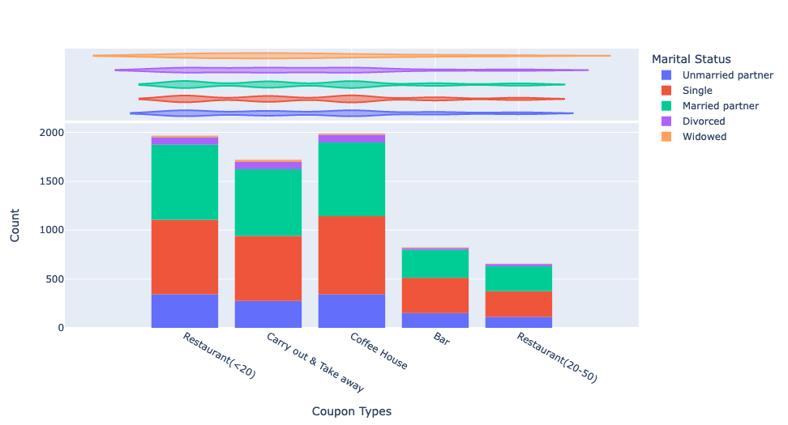

Data here could be skewed against certain marital status Divorced/widowed based on the count of corresponding drivers captured in the dataset.

5. Number of drivers accepting coupons is high around 6 PM and majority of them choose Restaurants less than 20 mins away or Cofee Houses next. While the next highest coupons accepted are around 7 AM where drivers prefer to accept coupons for Coffee House or Carry out & Take away. 
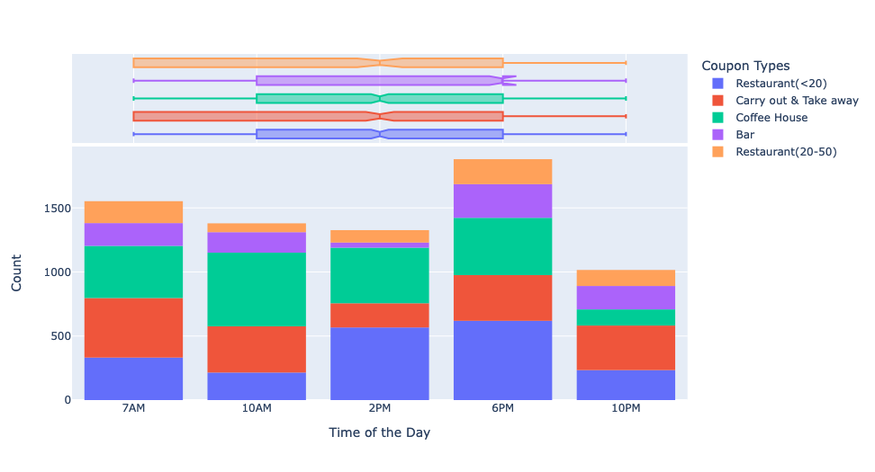

Below are a few observations from the data analysis for drivers who visit Bar : 

1. Only 41% of Drivers who visit Bar have accepted the coupon.

2. Acceptance rate of customers who went to a bar 3 or fewer times a month is 12.79% compared to customers who went to a bar more than 3 times is 7.61%
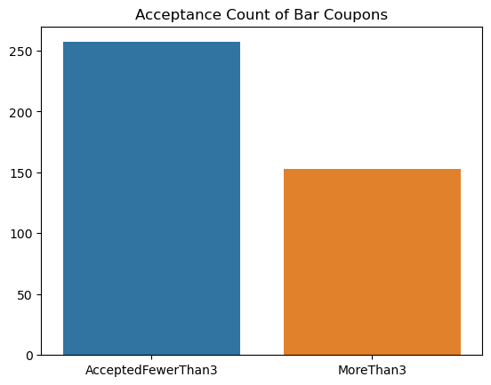

3. Only 20.9% of Drivers visit bar more than once and are older than 25 accept coupons
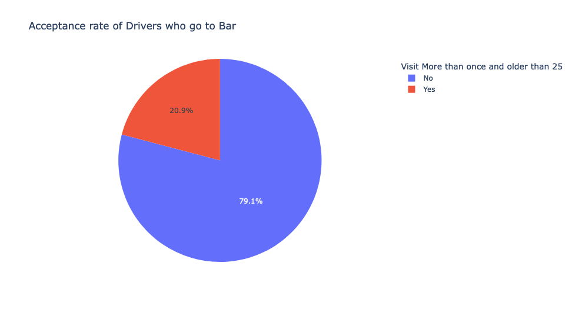 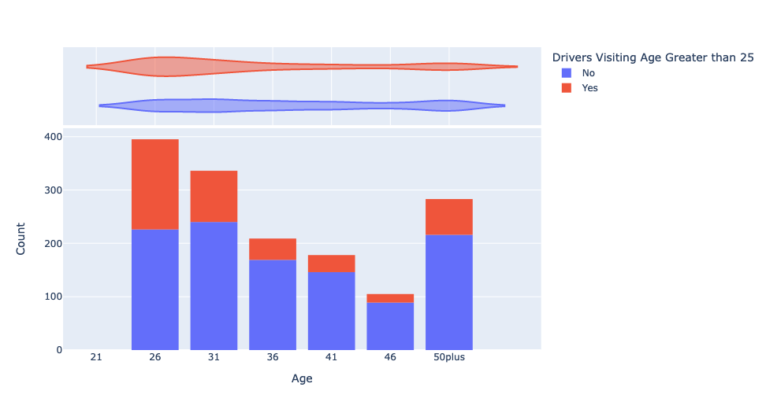 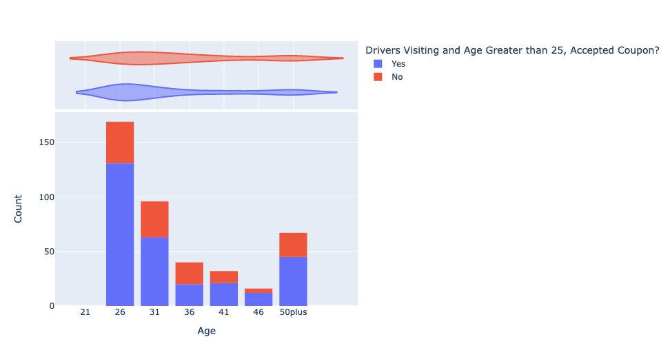

4. acceptance rate between drivers who go to bars more than once a month, had passengers that were not a kid and had occupations other than farming, fishing, or forestry is 71.3% compared to all Drivers who have accepted Bar coupons.
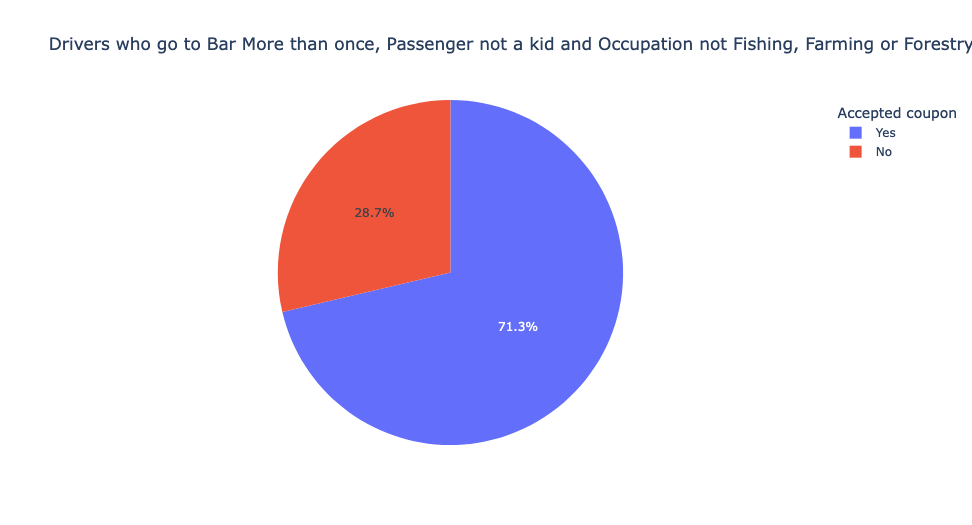

5. 71.3% of Drivers who go to bar do not have kids and are not widowed accept coupons
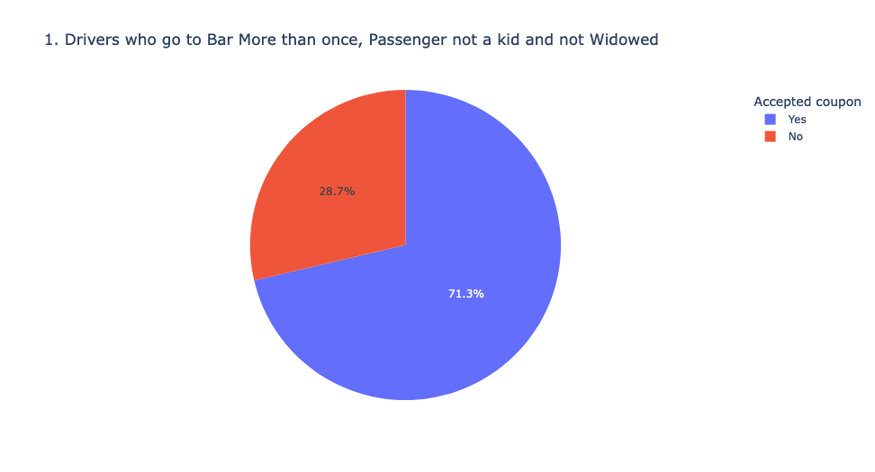

6. 72.2% of Drivers who go to bar are of age under 30 accept coupons
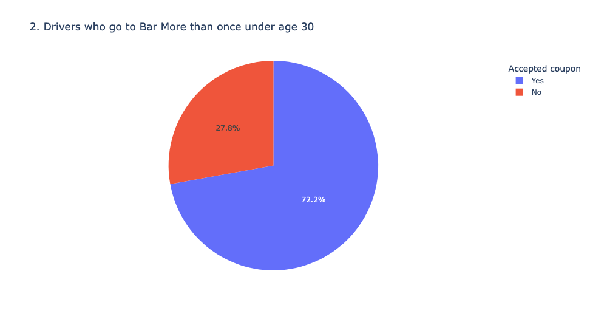

7. 67.9% of Drivers who go to bar more than 4 times with income less than 50K accept coupons
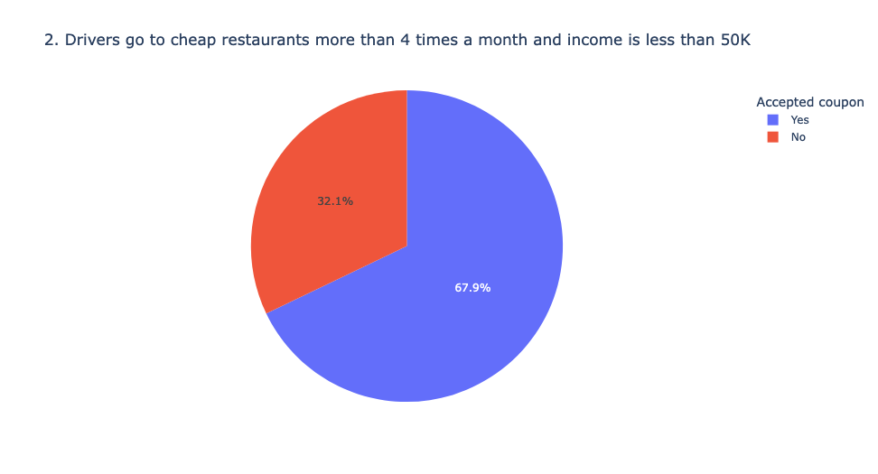

Below are a few observations from the data analysis for drivers who visit Coffee House : 

1. 49.9% of the drivers going to Coffee House have accepted the coupons
2. 14.04% of the drivers who went to coffee house more than 3 times accepted the coupons.
3. Drivers 25 and younger visit the Coffee House more often accept coupons.
4. Drivers 26 and older visit Coffee House more often accept coupons.
5. Drivers who visit Coffee House Alone and are unemployed accept coupons.

Further analysis can be done on other Coupons like Restaurant. Additional attributes are available compared to Bar and Coffee House i.e RestaurantLessThan20 and Restaurant20to50.

